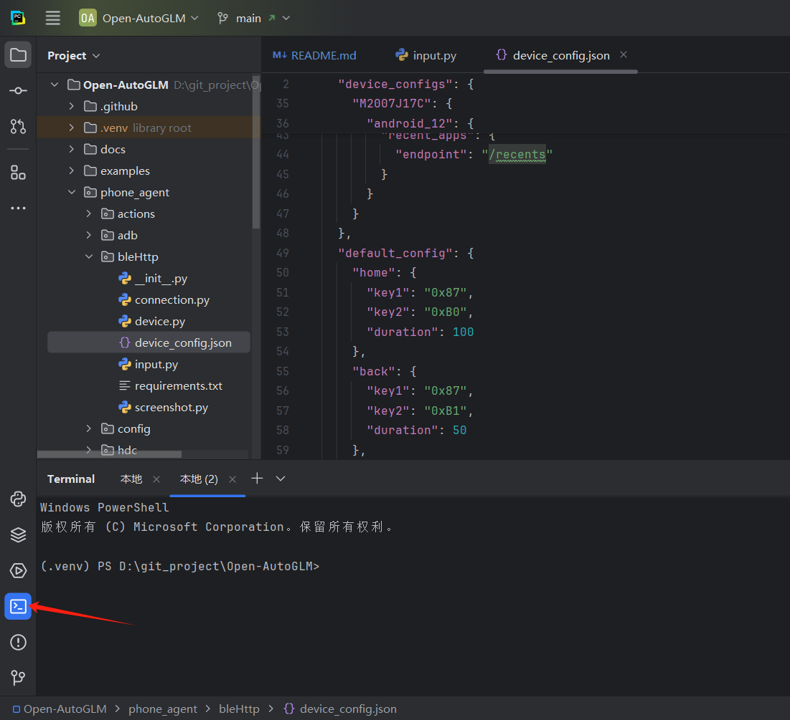

# openHandle-by-Open-AutoGLM


[Readme in English](README_en.md)

<div align="center">


</div>
<p align="center">
    👋 加入我们的 <a href="resources/WECHAT.md" target="_blank">微信:hzfaic</a> 
</p>


## 项目介绍

OpenHandle-by-Open-AutoGLM 是在phone_agent目录下增加了blehttp模块。把esp32c3提供的接口配适到Open-AutoGLM，其他没有修改；

esp32c3的固件可以替换ADB(Android Debug Bridge)的能力来控制设备;

app通过截图为大模型提供屏幕感知。

Agent 即可自动解析意图、理解当前界面、规划下一步动作并完成整个流程。系统还内置敏感操作确认机制，并支持在登录或验证码场景下进行人工接管。

> ⚠️
> 本项目仅供研究和学习使用。严禁用于非法获取信息、干扰系统或任何违法活动。请仔细审阅 [使用条款](resources/privacy_policy.txt)。


## 设计原理图解


## 使用步骤：
1.首先，下载openHandle-By-Open-AutoGLM（开源）。
2.手上有esp32c3硬件的，下载sdk，并烧录sdk或直接购买这个硬件；
3.手机安装apk（开源)；
4.连接控制即可：演示；

### 源码及固件：


OpenHandle-By-Open-AutoGLM：https://github.com/Samson1983/OpenHandle-By-Open-AutoGLM

OpenHandle-APP：https://github.com/Samson1983/OpenHandle-APP

app及固件下载：https://github.com/Samson1983/OpenHandle-APP/releases


 ## 快速安装

## PC 环境准备

### 1. Python 环境

建议使用 Python 3.10 及以上版本。

### 2. 用IDE打开项目:如PyCharm

### 3. 创建虚拟环境

打开命令行终端：



输入：`python -m venv .venv`


### 4.进入环境

 再输入：.venv\Scripts\activate.bat`


### 5.安装python项目依赖

### 安装依赖

```bash
pip install -r requirements.txt 
pip install -e .
```


## 启动命令：

示例：
```shell
python main.py --base-url https://open.bigmodel.cn/api/paas/v4 --model "autoglm-phone" --apikey "bcc5e3d20b2d4ff0ba9fc02f5b5197f8.TIVV4c4K20BCCEEB" --device-type blehttp --blehttp-url http://192.168.2.99:9123 "打开美团帮我搜索最近的火锅店"

python main.py --base-url https://open.bigmodel.cn/api/paas/v4 --model "autoglm-phone" --apikey "bcc5e3d20b2d4ff0ba9fc02f5b5197f8.TIVV4c4K20BCCEEB" --device-type blehttp --blehttp-url http://192.168.2.99:9123 "帮我打开汽水音乐"


python main.py --base-url https://open.bigmodel.cn/api/paas/v4 --model "autoglm-phone" --apikey "bcc5e3d20b2d4ff0ba9fc02f5b5197f8.TIVV4c4K20BCCEEB" --device-type blehttp --blehttp-url http://192.168.2.99:9123 "打开美团下单买一瓶洗发水，并提示我下单"

python main.py --base-url https://open.bigmodel.cn/api/paas/v4 --model "autoglm-phone" --apikey "bcc5e3d20b2d4ff0ba9fc02f5b5197f8.TIVV4c4K20BCCEEB" --device-type blehttp --blehttp-url http://192.168.2.99:9123 "在淘票票买一张 15 号下午《寒战1994》,亲橙里电影院,中间座位,加可乐爆米花单人餐,停在订单页。"
```


### 机型适配说明：

#### 手机按键及滑动适配：见device_config.json配置

```
通用蓝牙按键键值：
*  0xB0 = Home（主页）
*  0xB1 = Back（返回）
*  0xB3 = Recent Apps（最近任务 / 多任务）

滑动实现按键效果：
/home接口：（主页）
/back接口：（返回）
/recents：（最近任务 / 多任务）
```

目前只实验了下面机型：

| 操作方式 | 手机型号        | 操作系统   |
| -------- | --------------- | ---------- |
| 按键     | Redmi Truo3     | android_16 |
| 滑动     | Redmi Note Pro9 | android_12 |
|          |                 |            |

后续会适配更多机型；


---

## 调试说明

### 模型配置

```python
from phone_agent.model import ModelConfig

config = ModelConfig(
    base_url="http://localhost:8000/v1",
    api_key="EMPTY",  # API 密钥(如需要)
    model_name="autoglm-phone-9b",  # 模型名称
    max_tokens=3000,  # 最大输出 token 数
    temperature=0.1,  # 采样温度
    frequency_penalty=0.2,  # 频率惩罚
)
```

### Agent 配置

```python
from phone_agent.agent import AgentConfig

config = AgentConfig(
    max_steps=100,  # 每个任务最大步数
    device_id=None,  # ADB 设备 ID(None 为自动检测)
    lang="cn",  # 语言选择：cn(中文)或 en(英文)
    verbose=True,  # 打印调试信息(包括思考过程和执行动作)
)
```

### Verbose 模式输出

当 `verbose=True` 时，Agent 会在每一步输出详细信息：

```
==================================================
💭 思考过程:
--------------------------------------------------
当前在系统桌面，需要先启动小红书应用
--------------------------------------------------
🎯 执行动作:
{
  "_metadata": "do",
  "action": "Launch",
  "app": "小红书"
}
==================================================

... (执行动作后继续下一步)

==================================================
💭 思考过程:
--------------------------------------------------
小红书已打开，现在需要点击搜索框
--------------------------------------------------
🎯 执行动作:
{
  "_metadata": "do",
  "action": "Tap",
  "element": [500, 100]
}
==================================================

🎉 ================================================
✅ 任务完成: 已成功搜索美食攻略
==================================================
```

这样可以清楚地看到 AI 的推理过程和每一步的具体操作。

## 支持的应用

### Android 应用

Phone Agent 支持 50+ 款主流中文应用：

| 分类   | 应用              |
|------|-----------------|
| 社交通讯 | 微信、QQ、微博        |
| 电商购物 | 淘宝、京东、拼多多       |
| 美食外卖 | 美团、饿了么、肯德基      |
| 出行旅游 | 携程、12306、滴滴出行   |
| 视频娱乐 | bilibili、抖音、爱奇艺 |
| 音乐音频 | 网易云音乐、QQ音乐、喜马拉雅 |
| 生活服务 | 大众点评、高德地图、百度地图  |
| 内容社区 | 小红书、知乎、豆瓣       |

运行 `python main.py --list-apps` 查看完整列表。


## 可用操作

Agent 可以执行以下操作：

| 操作           | 描述              |
|--------------|-----------------|
| `Launch`     | 启动应用            |  
| `Tap`        | 点击指定坐标          |
| `Type`       | 输入文本            |
| `Swipe`      | 滑动屏幕            |
| `Back`       | 返回上一页           |
| `Home`       | 返回桌面            |
| `Long Press` | 长按              |
| `Double Tap` | 双击              |
| `Wait`       | 等待页面加载          |
| `Take_over`  | 请求人工接管(登录/验证码等) |


## 常见问题

我们列举了一些常见的问题，以及对应的解决方案：


### 截图失败(黑屏)

这通常意味着应用正在显示敏感页面(支付、密码、银行类应用)。Agent 会自动检测并请求人工接管。


 
